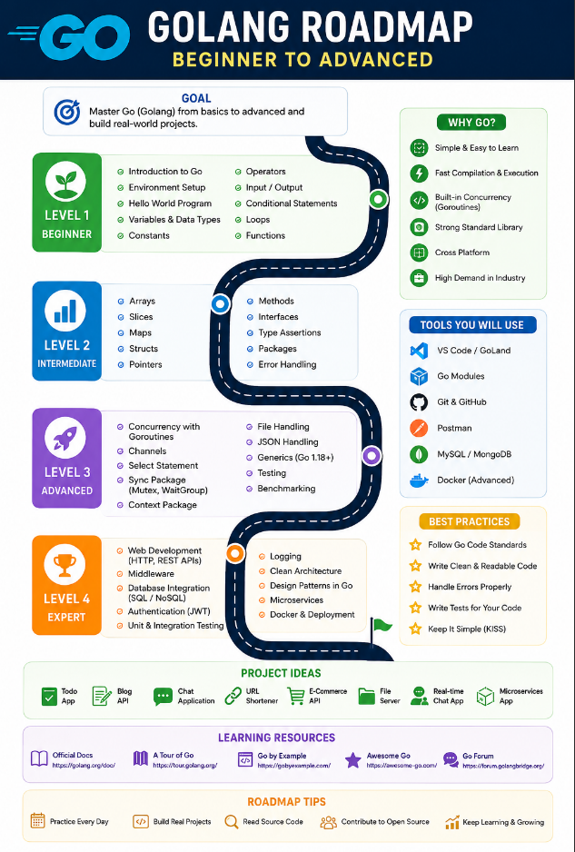

# 🚀 Go Beginner to Advanced

<p align="center">
  
</p>

<p align="center">
  <strong>A Complete Golang Learning Repository for Beginners to Advanced Developers.</strong>
</p>

<p align="center">
  Learn • Build Projects • Master Backend Development • Crack Interviews
</p>

<p align="center">
  
  
  
  
</p>

---

# 📖 About

This repository provides a structured roadmap to learn **Golang (Go)** from scratch and become a proficient Backend Developer.

Whether you are preparing for:

* 💼 SDE Internships
* 🏢 Product-Based Companies
* 🌐 Backend Development
* ☁️ Cloud Native Development
* 🚀 Open Source Contributions

This roadmap helps you learn Go step by step with theory, examples, and real-world projects.

---

# 🛣️ Learning Roadmap

## 🟢 Beginner

* Introduction to Go
* Installation and Setup of Go
* Variables and Data Types
* Constants and Operators
* Input and Output
* Conditional Statements
* Loops
* Arrays and Slices
* Maps and Structs
* Functions
* Pointers and Memory Management

---

## 🔵 Intermediate

* Methods and Interfaces
* Packages and Modules
* File Handling
* Error Handling
* Goroutines and Concurrency
* Channels
* Context Package
* JSON Handling

---

## 🟣 Backend Development

* REST API Development
* Building REST API with Gin Framework
* Building CRUD API with Go and MySQL
* JWT Authentication and Authorization
* Role-Based Authentication (RBAC)
* Middleware
* Database Integration
* Environment Variables

---

## 🔴 Advanced

* Dependency Injection
* Clean Architecture
* Logging
* Testing
* Docker
* Redis
* gRPC
* WebSocket
* Microservices
* Kafka Basics

---

## ⚫ Expert

* System Design
* Performance Optimization
* CI/CD
* Kubernetes Basics
* AWS Deployment
* Monitoring and Logging
* Distributed Systems

---

# 📂 Repository Structure

```text
Go-Beginner-to-Advanced/
│
├── README.md
├── GoBeginnerToAdvanced.png
│
├── Introduction to Go/
├── Installation and Setup of Go/
├── Variables and Data Types in Go/
├── Constants and Operators in Go/
├── Input and Output in Go/
├── Conditional Statements in Go/
├── Loops in Go/
├── Arrays and Slices in Go/
├── Maps and Structs in Go/
├── Functions in Go/
├── Pointers and Memory Management in Go/
├── Methods and Interfaces in Go/
├── Packages and Modules in Go/
├── File Handling in Go/
├── Goroutines and Concurrency in Go/
├── REST API Development in Go/
├── Building REST API with Gin Framework/
├── Building CRUD API with Go and MySQL/
├── JWT Authentication and Authorization in Go/
├── Role-Based Authentication (RBAC)/
└── Resources/
```

---

# 🛠 Tech Stack

* Go (Golang)
* Gin Framework
* MySQL
* GORM
* JWT
* REST API
* Docker
* Git & GitHub
* Linux
* Postman

---

# 🚀 Projects

## Beginner

* Calculator Program
* Student Grade System
* Bank Account System

## Intermediate

* CLI To-Do Application
* File Management System
* JSON Parser

## Advanced

* REST API
* CRUD API with MySQL
* JWT Authentication System
* RBAC Authentication

## Expert

* E-Commerce Backend
* Hospital Management System
* Hotel Management System
* URL Shortener
* Microservices Project

---

# 📚 Learning Resources

## Official Documentation

* https://go.dev
* https://go.dev/doc

## Framework

* https://gin-gonic.com

## Practice

* https://exercism.org/tracks/go
* https://leetcode.com

---

# 🎯 Interview Preparation

Topics Covered:

* Go Basics
* OOP Concepts in Go
* Structs and Interfaces
* Pointers
* Concurrency
* Goroutines
* Channels
* REST APIs
* MySQL
* JWT
* Gin Framework
* System Design

---

# 📅 Suggested 8-Week Learning Plan

## Week 1

* Introduction
* Installation
* Variables
* Operators

## Week 2

* Loops
* Arrays
* Slices
* Maps

## Week 3

* Functions
* Structs
* Interfaces
* Pointers

## Week 4

* Packages
* Modules
* File Handling
* Concurrency

## Week 5

* REST API Development
* Gin Framework

## Week 6

* CRUD API
* MySQL
* GORM

## Week 7

* JWT Authentication
* RBAC

## Week 8

* Build Real Projects
* Docker
* Deployment

---

# 🌟 Best Practices

* Write Clean Code
* Follow Go Coding Standards
* Handle Errors Properly
* Keep Functions Small
* Use Interfaces Wisely
* Write Modular Code
* Build Reusable Packages
* Write Tests
* Use Git Effectively

---

# 🤝 Contributing

Contributions are welcome!

1. Fork the repository
2. Create a feature branch
3. Commit your changes
4. Push to GitHub
5. Open a Pull Request

---

# ⭐ Support

If this repository helps you, please give it a ⭐.

It motivates me to create more educational content for the developer community.

---

# 📜 License

This project is licensed under the MIT License.

---

<p align="center">
<b>☕ Learn Go • Build Projects • Master Backend • Crack Interviews 🚀</b>
</p>

<p align="center">
Made with ❤️ by Anup Kumar
</p>
